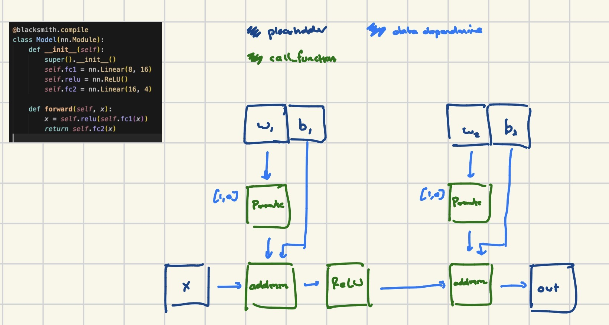

# Blacksmith: a Compute Graph Operation Fuser for Metal

The blacksmith compiler builds on my previous work on [soptRT](https://github.com/tkhdse/soptRT). Blacksmith is designed to perform fusion for Metal kernels so that I can program on my new Mac GPU. 


## Setup
Compile JIT compiler code for IR generation and transformation passes. 
```
make
```

[Optional: create and activate virtual environment]
```
pip install -r requirements.txt
. venv/bin/activate
```

Execute script containing `blacksmith.compile(MODEL)`:
```
python3 python/main.py
```  


## Implementation
Blacksmith leverages PyTorch's TorchDynamo to generate an FX Graph (compute graph) for a given model definition. Blacksmith lowers this high-level compute graph to it's own IR containing a `FusionGraph` and `FCNOps` ("Fusion-candidate" ops). 

FX Graph for the sample model defined in `python/main.py`:


TBA